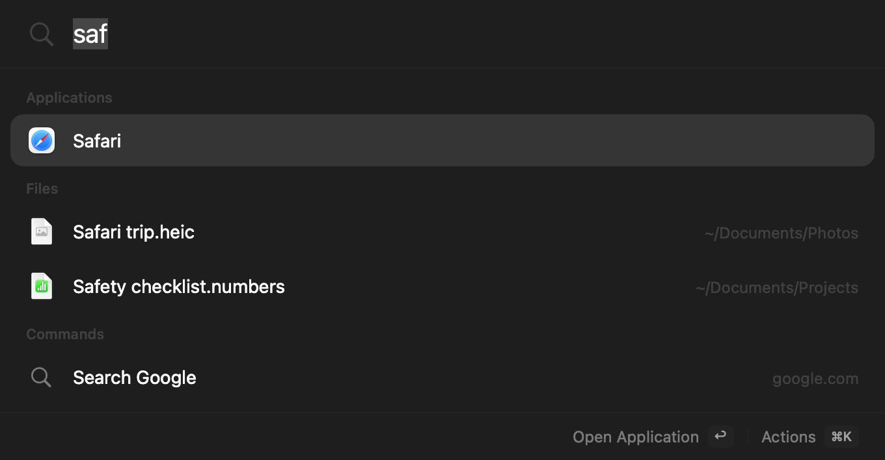
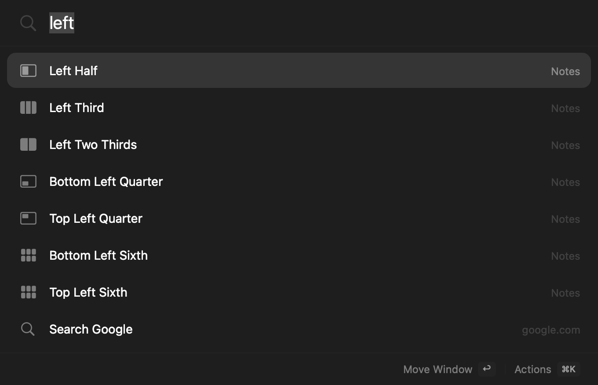
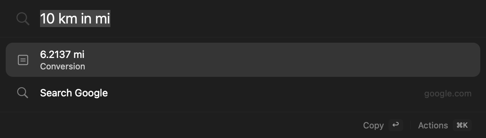

# Jevcast

A native macOS launcher and window manager. Press **Option–Space** to open apps, find files, calculate, move windows, and reuse what you copied.

For loose requests such as “make this window bigger,” Jevcast can use **Jev by [TypeSafe AI](https://typesafe.ai)** to match your words to a known action. This is optional and uses your own API key. The launcher works without it.

[Install with your agent](#install-with-your-agent) · [See what it does](#what-you-can-do) · [Website](https://jevcast.vercel.app)



- Free and open source under the [MIT License](LICENSE).
- Built with SwiftUI and AppKit, with no third-party package dependencies. Runs on macOS 14 or later, on Apple silicon and Intel.
- No Jevcast account or analytics. Core search, clipboard history, and voice run on your Mac.

## Install with your agent

Copy this prompt into a coding agent on the Mac where you want Jevcast. The Mac needs Xcode 26 or later to build it.

```
Install Jevcast from the official source repository:
https://github.com/RyanErkal/jevcast

First check that this Mac can run Xcode 26 or later and has it installed. If
not, report the requirement and stop. Clone the repository and check out its
latest published release tag. If there is no release tag, stop. Verify that `git remote get-url origin`
resolves exactly to `https://github.com/RyanErkal/jevcast.git`. Run `swift test`
and `scripts/build.sh`. Verify the built app code signature with
`codesign --verify --deep --strict --verbose=2 "dist/Jevcast.app"` and report
the result. After those checks pass, quit any running Jev Launcher or Jevcast.
Back up an existing `/Applications/Jevcast.app` before replacing it, and keep
all preferences and settings. Install the new app at `/Applications/Jevcast.app`
and open it. Do not bypass Gatekeeper or change macOS security settings.
```

Open the app from Applications. A welcome window helps you choose a shortcut and allow what you need. After that, the app lives in the menu bar. Open **Help › Welcome Guide** to see the window again.

## What you can do

Press **Option–Space** and type. If another app already uses that shortcut, choose a different one in the welcome window or in Settings.

| Type                                                       | What happens                                                             |
| ---------------------------------------------------------- | ------------------------------------------------------------------------ |
| `safari`                                                   | Opens Safari. Aliases you add in Settings › Search also work.            |
| `left half`, `top right`, `middle third`, `next monitor`   | Moves the window you were using.                                         |
| `12 * (8 + 2)`, `100 + 10%`                                | Shows the answer. Return copies it.                                      |
| `10 km in mi`, `20 c in f`                                 | Converts length, mass, temperature, time, data, volume, speed, and area. |
| `invoice`, `kind:pdf in:downloads`, `files modified today` | Finds files by name, kind, folder, and date.                             |
| `gh swiftui`, `yt piano`, `maps cafes`, `wiki moon`        | Searches a site. Add your own keywords in Settings › Search.             |
| `clip`                                                     | Shows the last 50 text items you copied. Return copies one again.        |
| `wi-fi settings`                                           | Opens that System Settings pane.                                         |
| `port 3000`, `kill 5173`, `ports`                          | Lists what listens on a local port. ⌫ twice stops it.                    |
| `dark mode`, `caffeinate`, `empty trash`, `my ip`          | Runs a built-in command. Disruptive ones ask for a second Return.        |
| The name of your own command                               | Runs a command you added in Settings › Commands.                         |
| `notes left half`                                          | Opens Notes, then arranges its window.                                   |
| `search github for swift ui`                               | Searches that site with the rest of your words.                          |
| `5m tea`, `timer 10 min`                                   | Starts a timer with a notification. `timers` lists them.                 |
| `:tada`, `emoji party`                                     | Finds an emoji or symbol. Return copies, Shift–Return pastes.            |
| `ans * 2`                                                  | Uses the last answer. `history` lists recent answers.                    |
| A menu item, Shortcut, workflow, or snippet name           | Runs it. Menu items come from the app you were using.                    |
| `scheduled tasks`, `what runs at login`, `cron`            | Lists launch agents, daemons, crontab lines, and timers, in plain words. |
| `calendar`, `my day`, `reminders`                          | Lists events and reminders. Join calls, complete, or move them.          |
| `remind me to call mum at 5pm`, `add event lunch friday 1pm` | Adds a reminder or an event.                                           |
| `contact sam`                                              | Finds a person to email, message, or call.                               |
| `tabs`, `tabs docs`, `history swift`                       | Finds open tabs and browser history. Switch, close, or copy.             |
| `this`, `copy link`                                        | Acts on the page, Finder selection, or selected text in front.           |
| `mail`, `inbox`, `mail invoice`                            | Opens the Jevcast mail window, or searches your mail.                    |
| `ask what is a p-value`                                    | Luna answers in the panel. Needs Luna on.                                |
| `every weekday at 8am brief me on my meetings`             | Schedules a Luna task. Its result arrives as a notification.             |
| `task results`                                             | Lists what scheduled tasks wrote.                                        |

**Move a window** by typing a layout:



**Convert units** and copy the answer:



## Optional: Jev by TypeSafe AI

Jevcast finds apps, files, and actions locally. To match a loose request to one of those actions, add your own [TypeSafe AI](https://typesafe.ai) API key, or an [OpenRouter](https://openrouter.ai/typesafe/jev-1.13) key to run Jev through OpenRouter, in Settings › Input and turn on **Use Jev for natural-language matching**. Jevcast picks the service from the key: an `sk-or-` key goes to OpenRouter. The key is kept in your macOS Keychain. Local results never wait for Jev.

**Two steps.** Jev also names the kind of request, such as "open an app", "move a window", or "calendar", in a second small call at the same time. When the kind and the pick agree, the pick stands. When they differ, Jev chooses again among every item of that kind, for example all your apps rather than the first 120 candidates. A window move that loosely names a running app, such as "put the chrom one on the left", then asks which app. Turn this off in Settings › Input.

Jev reads each request after a short pause, typed or spoken. It receives that text and a short list of candidate names: apps, System Settings panes, window actions, built-in commands, your own commands, workflows, Shortcuts, and snippets by name, menu item names from the app you were using, sites, files, and folders. It can only choose from that list or return no match. It never writes a command. A whole-name match you typed stays first. Jevcast does not add file or folder paths, clipboard text, or audio to the request. Any path you type yourself is part of the text sent. See [Privacy](#privacy) for the full network details.

## Optional: Luna

Jev decides what a request means. Luna does the writing when a request needs it. Luna is GPT-6 Luna, run through [OpenRouter](https://openrouter.ai) with your own OpenRouter key. Turn it on in Settings › Luna and choose Fast, High, or Max effort.

- `ask …`, `? …`, or `luna …` answers in the panel. Return copies the answer, and Shift–Return pastes it.
- With text selected in any app, the launcher offers Fix Spelling and Grammar, Make Shorter, Make More Formal, Make Friendlier, Summarise, Explain, and Translate to English. Type your own instruction, such as `translate to turkish`, for anything else. Return replaces the selection with Luna's text. A question about the text is copied instead.
- In the mail window, Luna summarises a message or drafts a reply from a short instruction, such as "yes, but next week".

**Scheduled tasks.** Type a schedule and a request, such as `every weekday at 8am brief me on my meetings and unread email`, `summarise my reminders every evening at 7`, or `every 2 hours check my unread mail`. Return schedules it. At that time, Jevcast reads only the data the request names and you allow: today's and tomorrow's events, reminders due soon, or unread inbox mail (senders, subjects, and previews). Luna writes the result, and a notification shows its first lines. Click the notification to read it all. Every result is also saved as a Markdown file in `~/Library/Application Support/Jevcast/Luna Tasks`. `scheduled tasks` lists your tasks with Run Now, Pause, and Delete, and `task results` lists past runs. Tasks run while Jevcast is open. A run missed by more than three hours, for example while the Mac slept, is skipped and noted.

Luna reads only what you allow. What you type after `ask` is sent once Luna is on. Selected text, mail messages, calendar and reminders, and the unread mail list each have their own switch, and all are off at first. Jevcast checks every request against those switches before it sends it. Settings › Luna lists each request with what kind of context it carried and its cost, without the text. Luna never runs an action.

## Use

Keys in the launcher:

| Keys            | Action                               |
| --------------- | ------------------------------------ |
| Return          | Run the selected result              |
| Up, Down        | Select another result                |
| Escape          | Close                                |
| Command–K       | More actions for the selected result |
| Command–Y       | Quick Look                           |
| Command–R       | Show in Finder                       |
| Command–Shift–C | Copy the path                        |

Results learn from use. Things you pick often and recently move up, and favourites rank higher. Right-click an app to add it to your favourites. With nothing typed, the launcher is the search bar alone. Click a row to run it, or move the pointer over the rows to pick one, then press Return.

### File search

- `find file invoice` searches file names. `find folder invoices` searches folders.
- `kind:pdf in:downloads` and `pdfs in downloads` show PDFs in Downloads.
- `kind:image modified:yesterday`, `files modified today`, and `modified:week` filter by date.
- `in:"~/Documents/My Folder" report` searches one folder.
- A full path or a `~/` path opens that file or folder.

File search uses the Spotlight index and stays inside the folders in Settings › Search. It skips app bundles, Git folders, dependency folders, caches, and the Trash. It does not search inside documents.

### Window shortcuts

Allow Accessibility access, then turn on **Use direct window shortcuts** in Settings › Windows. Hold **Control–Option–Command** and press:

| Key                   | Action                                                  |
| --------------------- | ------------------------------------------------------- |
| Left, Right, Up, Down | Halves                                                  |
| U, I, J, K            | Top left, top right, bottom left, bottom right quarters |
| 1, 2, 3               | Left, middle, right thirds                              |
| Return                | Maximise                                                |
| Z                     | Restore                                                 |
| N, P                  | Next or previous display                                |

Press a half again to cycle its size: 1/2, 2/3, then 1/3. The middle third cycles 1/3, 1/2, then 2/3. Edge snapping is a separate setting. If you use Rectangle or the macOS option "Drag windows to screen edges to tile", turn off one of them, so two apps do not move the same window.

### Voice

Turn on **Listen when the launcher opens** in Settings › Input and allow Microphone and Speech Recognition. The launcher then listens each time it opens. Typing stops listening. While it listens, the MacBook's built-in speakers are muted so their sound is not transcribed, and they come back when listening stops. Headphones are not muted. Recognition runs on your Mac only, and audio is not saved. If on-device recognition is not available for your language, the app tells you and typing still works.

### Commands

Type `port 3000` to see what listens on that port. Pick a row and press ⌫ twice to stop it, and the launcher stays open. ⌘⌫ works without picking the row first. Return opens the port in your browser. `ports` lists every listener with its CPU, memory, uptime, project folder, and whether it is open to your network. Your own servers come first. macOS services and other users' processes are marked, because they restart or need an administrator. ⌘K opens the port in a browser, shows its folder, force stops it, or copies its PID or command line. Built-in commands, such as **Toggle Dark Mode**, **Keep Mac Awake for 1 Hour**, and **Copy Local IP Address**, run fixed programs with fixed arguments and no shell. Add your own in Settings › Commands. Those run with `zsh -lc` from your home folder. Put `{input}` in a command to pass text typed after its name, as a quoted argument. Settings › Commands also holds **workflows**, which run several steps from one name, and **snippets**. Jev can choose any of these by name, but it never sees or writes command text.

### Your Mac: tasks, calendar, contacts, tabs, and "this"

Rows from these sources have their own actions. Return runs the first one, and ⌘K lists all of them.

- **Scheduled tasks.** `scheduled tasks` lists launch agents in `~/Library/LaunchAgents` and `/Library/LaunchAgents`, daemons in `/Library/LaunchDaemons`, your crontab, and Jevcast timers. Each row gives the schedule in plain words, such as "Every day at 09:30", the next run, whether it runs now or its last run failed, and a warning when its program is missing or in an unusual folder. Apple's own jobs are hidden; add `apple` to see them. `scheduled tasks failing` lists failed jobs only. An agent can run now, turn off, or turn on. For a daemon, ⌘K copies the `sudo` command, because it needs an administrator.
- **Calendar and Reminders.** `calendar` lists today and tomorrow, `calendar week` the next seven days, and `calendar <words>` finds events. Join Call opens Zoom, Meet, and Teams links. Your own events move 15 minutes or an hour later. `reminders` lists open reminders, overdue first. `remind me to …` and `add event …` read the date and time from your words, including `in 20 minutes`, `at 9`, and `friday 1pm`.
- **Contacts.** `contact <name, email, or number>` finds a person. Email opens the Jevcast mail window. Message and Call open Messages and FaceTime.
- **Tabs and history.** `tabs` lists open tabs in Safari, Chrome, Arc, Brave, Edge, and Vivaldi. Jevcast never starts a browser to read them. `history <words>` searches a private copy of browser history, which Jevcast deletes after each search. Safari history needs Full Disk Access.
- **This.** After you start typing, Jevcast reads the page, the Finder selection, or the selected text in the app in front. Type `this` to see every action for it, or an action such as `copy link`. It uses Automation access only if you already gave it, unless you type `this`.

### Mail

`mail` or `inbox` opens the Jevcast mail window: Inbox, Unread, Flagged, and each account's mailboxes on the left, messages in the middle, and the message on the right. `mail <words>` searches from the launcher.

Jevcast reads the mail that Apple Mail keeps on this Mac, so Mail does not have to be open to read it. Changes go through Apple Mail, which starts hidden when it is not running: archive, delete, move, flag, read or unread, reply, reply all, forward, and new messages. Mail then applies your accounts, rules, and sync as usual. Mail shows in the Dock while it runs.

Keys: ↑↓ or J K move, E archives, ⌫ deletes, R replies, Shift–R replies to all, F forwards, S flags, U marks read or unread, C writes a new message, and ⌘Return sends. HTML mail shows with scripts off, and every remote load is blocked, so tracking pixels and remote images do not load. Links open in your browser.

Jevcast needs Full Disk Access to read Apple Mail. The mail window tells you how to allow it.

### Jev memory and usage

When you choose a result for a request, Jevcast remembers it on this Mac, and the same request then needs no Jev call. Press ⌘Z on a Jev or remembered pick to undo it and forget it. A whole-name match, a sum, a URL, a timer, or a port lookup never asks Jev. Settings › Usage shows requests, tokens, and cost for 7 days, 30 days, and all time.

## Privacy

The app has no account, no analytics, and no crash reporting. It connects to the internet for four things only:

| When                                                                             | Where                                | What is sent                                                                                                                                                                                                          |
| -------------------------------------------------------------------------------- | ------------------------------------ | --------------------------------------------------------------------------------------------------------------------------------------------------------------------------------------------------------------------- |
| Once a day, if **Check for updates automatically** is on (default: on)           | `api.github.com`                     | A request for the newest release, with the app version. GitHub sees your IP address, as with any web request. Nothing is downloaded.                                                                                  |
| After each pause in typing or speech, if natural-language matching is on (default: off) | `api.typesafe.ai`, or `openrouter.ai` with an OpenRouter key | The text you typed or said and a short list of candidate names: apps, settings panes, window actions, commands, workflows, Shortcuts, snippet names, menu item names, search sites, files, and folders. Jevcast does not add file or folder paths, command text, snippet text, clipboard text, or audio. A path you type yourself is included in the query. Jev can only choose one of the supplied candidates. |
| When you ask Luna, if Luna is on (default: off)                                  | `openrouter.ai`                      | What you typed after `ask`, or your instruction. Selected text and mail messages only when you turn on each one in Settings › Luna. Never file paths, clipboard history, or audio. |
| When you open a web search or a URL                                              | Your default browser                 | Whatever you chose to open.                                                                                                                                                                                           |

Everything else stays on your Mac. Clipboard history is kept in memory only, holds plain text only, and skips items that password managers mark as concealed. The app writes one file of its own: a cache of your app list in `~/Library/Caches/JevLauncher`. A browser history search copies each history database to a temporary folder and deletes it after the search. Mail, Calendar, Reminders, Contacts, tabs, and selected text are read on this Mac and are not stored by Jevcast.

## Permissions

| Permission                        | Needed for                  | Required?               |
| --------------------------------- | --------------------------- | ----------------------- |
| Accessibility                     | Moving and resizing windows | Only for window actions |
| Microphone and Speech Recognition | Voice input                 | Only for voice          |
| Calendars, Reminders, Contacts    | Events, reminders, people   | Only for those rows     |
| Automation (Apple Events)         | Browser tabs, Finder selection, and changes to mail | Only for those features |
| Full Disk Access                  | Reading Apple Mail and Safari history | Only for mail and Safari history |

Allow each one from the welcome window, Settings, or the **Permissions** menu in the menu bar. Each item opens the matching page of System Settings.

## Build from source

You need Xcode 26 or later (it includes the macOS 26 SDK). The built app runs on macOS 14 or later.

```sh
git clone https://github.com/RyanErkal/jevcast.git
cd jevcast
swift test
scripts/build.sh            # universal build; ARCHS=arm64 scripts/build.sh builds one architecture
open "dist/Jevcast.app"
```

A local build can ask for permissions again after each rebuild. See [docs/DEVELOPMENT.md](docs/DEVELOPMENT.md) for the code layout and diagnostic flags, and [docs/RELEASING.md](docs/RELEASING.md) for the source release process.

## Contributing

Bug reports and pull requests are welcome. Read [CONTRIBUTING.md](CONTRIBUTING.md) first. Report security problems privately, as [SECURITY.md](SECURITY.md) describes.

## License

[MIT](LICENSE) © 2026 Ryan Erkal
