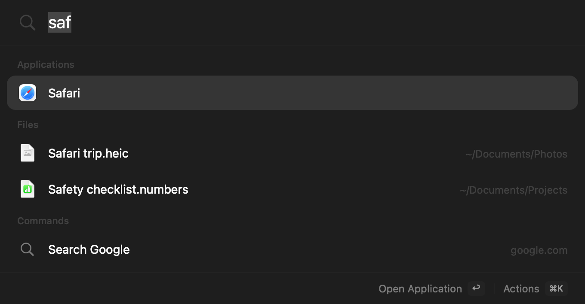
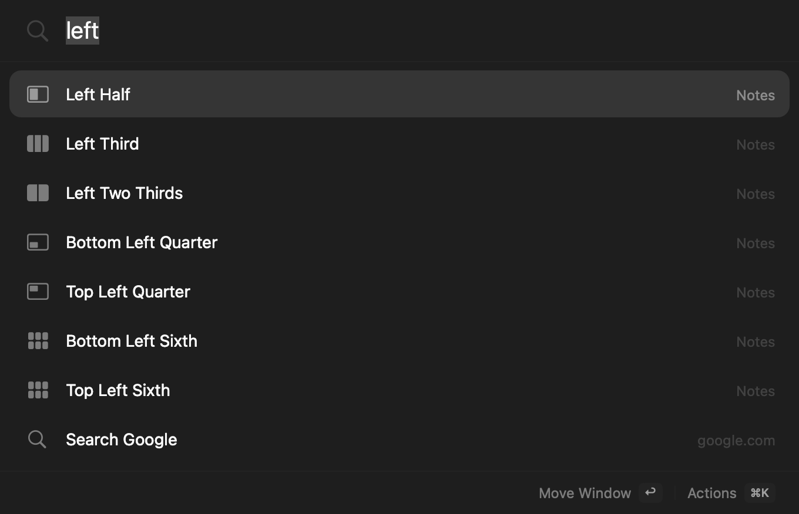
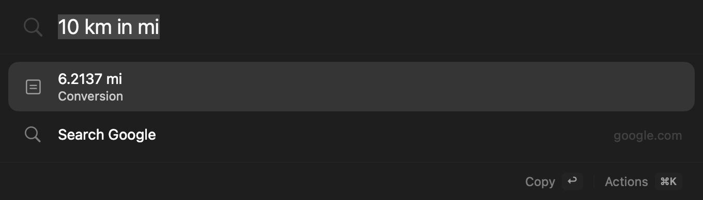

# Jevcast

A native macOS launcher and window manager. Press **Option–Space** to open apps, find files, calculate, move windows, and reuse what you copied.

For loose requests such as “make this window bigger,” Jevcast can use **Jev by [TypeSafe AI](https://typesafe.ai)** to match your words to a known action. This is optional and uses your own API key. The launcher works without it.

[Install with your agent](#install-with-your-agent) · [See what it does](#what-you-can-do) · [Website](https://jevcast.vercel.app)



- Free and open source under the [MIT License](LICENSE).
- Built with SwiftUI and AppKit, with no third-party package dependencies. Runs on macOS 14 or later, on Apple silicon and Intel.
- No Jevcast account or analytics. Core search, clipboard history, and voice run on your Mac.

## Install with your agent

Copy this prompt into a coding agent on the Mac where you want Jevcast. The Mac needs Xcode 26 or later and Homebrew to build it.

```
Install Jevcast from the official source repository:
https://github.com/RyanErkal/jevcast

First check that this Mac can run Xcode 26 or later and has it installed. If
not, report the requirement and stop. Clone the repository and check out its
latest published release tag. If there is no release tag, stop. Verify that `git remote get-url origin`
resolves exactly to `https://github.com/RyanErkal/jevcast.git`. If the checkout
has `scripts/ghosttykit.sh`, install Homebrew's `zig@0.15` and Xcode's Metal
Toolchain (`xcodebuild -downloadComponent MetalToolchain`), then run
`scripts/ghosttykit.sh`. Run `swift test` and `scripts/build.sh`. Verify the built app code signature with
`codesign --verify --deep --strict --verbose=2 "dist/Jevcast.app"` and report
the result. After those checks pass, quit any running Jev Launcher or Jevcast.
Back up an existing `/Applications/Jevcast.app` before replacing it, and keep
all preferences and settings. Install the new app at `/Applications/Jevcast.app`
and open it. Do not bypass Gatekeeper or change macOS security settings.
```

Open the app from Applications. A welcome window helps you choose a shortcut and allow what you need. After that, the app lives in the menu bar. Open **Help › Welcome Guide** to see the window again.

## What you can do

Press **Option–Space** and type. If another app already uses that shortcut, choose a different one in the welcome window or in Settings.

| Type                                                         | What happens                                                                                                                                          |
| ------------------------------------------------------------ | ----------------------------------------------------------------------------------------------------------------------------------------------------- |
| `safari`                                                     | Opens Safari. Aliases you add in Settings › Search also work.                                                                                         |
| `left half`, `top right`, `middle third`, `next monitor`     | Moves the window you were using.                                                                                                                      |
| `12 * (8 + 2)`, `100 + 10%`                                  | Shows the answer. Return copies it.                                                                                                                   |
| `10 km in mi`, `20 c in f`                                   | Converts length, mass, temperature, time, data, volume, speed, and area.                                                                              |
| `invoice`, `kind:pdf in:downloads`, `files modified today`   | Finds files by name, kind, folder, and date.                                                                                                          |
| `gh swiftui`, `yt piano`, `maps cafes`, `wiki moon`          | Searches a site. Add your own keywords in Settings › Search.                                                                                          |
| `clip`, `clip links`                                         | Shows what you copied: text, images, files, links, and more. Return copies one again, Shift–Return pastes it. The first row opens the Clipboard view. |
| `wi-fi settings`                                             | Opens that System Settings pane.                                                                                                                      |
| `port 3000`, `kill 5173`, `ports`                            | Lists what listens on a local port. ⌫ twice stops it.                                                                                                 |
| `dark mode`, `caffeinate`, `empty trash`, `my ip`            | Runs a built-in command. Disruptive ones ask for a second Return.                                                                                     |
| The name of your own command                                 | Runs a command you added in Settings › Library.                                                                                                       |
| `notes left half`                                            | Opens Notes, then arranges its window.                                                                                                                |
| `search github for swift ui`                                 | Searches that site with the rest of your words.                                                                                                       |
| `5m tea`, `timer 10 min`                                     | Starts a timer with a notification. `timers` lists them.                                                                                              |
| `:tada`, `emoji party`                                       | Finds an emoji or symbol. Return copies, Shift–Return pastes.                                                                                         |
| `ans * 2`                                                    | Uses the last answer. `history` lists recent answers.                                                                                                 |
| A menu item, Shortcut, workflow, or snippet name             | Runs it. Menu items come from the app you were using.                                                                                                 |
| `scheduled tasks`, `what runs at login`, `cron`              | Lists launch agents, daemons, crontab lines, timers, scheduled briefs, and automations, in plain words.                                                    |
| `calendar`, `my day`, `reminders`                            | Lists events and reminders. Join calls, complete, or move them.                                                                                       |
| `remind me to call mum at 5pm`, `add event lunch friday 1pm` | Adds a reminder or an event.                                                                                                                          |
| `contact sam`                                                | Finds a person to email, message, or call.                                                                                                            |
| `tabs`, `tabs docs`, `history swift`                         | Finds open tabs and browser history. Switch, close, or copy.                                                                                          |
| `this`, `copy link`                                          | Acts on the page, Finder selection, or selected text in front.                                                                                        |
| `inbox`, `show mail`, `mail invoice`                         | Opens Mail in the launcher, or searches your mail.                                                                                                    |
| `ask what is a p-value`                                      | AI chat answers in the panel. Needs AI writing on.                                                                                                           |
| `every weekday at 8am brief me on my meetings`               | Schedules a brief. `task results` lists what it wrote.                                                                                           |
| `task results`                                               | Lists what scheduled tasks wrote.                                                                                                                     |
| `automations`                                                | Lists your automations and anything that needs you.                                                                                                   |
| `dictation history`                                          | Lists what you dictated. Return pastes it again.                                                                                                      |
| `cleanup`, `cool down`                                       | Lists idle servers, leftover processes, and simulators to stop.                                                                                       |
| `/`, `/cal`                                                  | Lists only functions and your library, in groups. Tab completes the name.                                                                             |
| `$`, `$deploy`                                               | Lists only your own commands, workflows, and snippets.                                                                                                |

**Move a window** by typing a layout:



**Convert units** and copy the answer:



## Optional: Jev by TypeSafe AI

Jevcast finds apps, files, and actions locally. To match a loose request to one of those actions, add your own [TypeSafe AI](https://typesafe.ai) API key, or an [OpenRouter](https://openrouter.ai/typesafe/jev-1.13) key to run Jev through OpenRouter, in Settings › AI › Jev and turn on **Use Jev for natural-language matching**. Jevcast picks the service from the key: an `sk-or-` key goes to OpenRouter. The key is kept in your macOS Keychain. Local results never wait for Jev.

**Two steps.** Jev also names the kind of request, such as "open an app", "move a window", or "calendar", in a second small call at the same time. When the kind and the pick agree, the pick stands. When they differ, Jev chooses again among every item of that kind, for example all your apps rather than the first 120 candidates. A window move that loosely names a running app, such as "put the chrom one on the left", then asks which app. Turn this off in Settings › AI › Jev.

Jev reads each request after a short pause, typed or spoken. It receives that text and a short list of candidate names: apps, System Settings panes, window actions, built-in commands, your own commands, workflows, Shortcuts, and snippets by name, menu item names from the app you were using, sites, files, and folders. It can only choose from that list or return no match. It never writes a command. A whole-name match you typed stays first. Jevcast does not add file or folder paths, clipboard text, or audio to the request. Any path you type yourself is part of the text sent. See [Privacy](#privacy) for the full network details.

## Optional: AI writing

Jev decides what a request means. AI writing does the writing when a request needs it. It sends the request through [OpenRouter](https://openrouter.ai) to the model you pick, such as GPT-6 Luna, with your own OpenRouter key. Turn it on in Settings › AI › Writing. Choose a reasoning effort from Low to Max, and turn **Fast** on for the faster service tier. Fast is a separate switch, not an effort level.

- Ask AI: `ask …` or `? …` answers in the panel. Return copies the answer, and Shift–Return pastes it.
- With text selected in any app, the launcher offers Fix Spelling and Grammar, Make Shorter, Make More Formal, Make Friendlier, Summarise, Explain, and Translate to English. Type your own instruction, such as `translate to turkish`, for anything else. Return replaces the selection with the new text. A question about the text is copied instead.
- In Mail, AI writing summarises a message or drafts a reply from a short instruction, such as "yes, but next week".

**Scheduled briefs.** Type a schedule and a request, such as `every weekday at 8am brief me on my meetings and unread email`, `summarise my reminders every evening at 7`, or `every 2 hours check my unread mail`. Return schedules it, and the launcher shows it in the scheduled tasks list. At that time, Jevcast reads only the data the request names and you allow: today's and tomorrow's events, reminders due soon, or unread inbox mail (senders, subjects, and previews). The writing model writes the result. A successful run is silent: `task results` lists past runs, and every result is also saved as a Markdown file in `~/Library/Application Support/Jevcast/Luna Tasks`. A failed run shows a notch alert. `scheduled tasks` lists your briefs with Run Now, Pause, and Delete. Briefs run while Jevcast is open. A run missed by more than three hours, for example while the Mac slept, is skipped and noted.

AI writing reads only what you allow. What you type after `ask` is sent once AI writing is on. Selected text, mail messages, calendar and reminders, the unread mail list, and dictation transcripts each have their own switch, and all are off at first. Jevcast checks every request against those switches before it sends it. Settings › AI › Writing lists each request with what kind of context it carried and its cost, without the text. AI writing never runs an action.

## Use

Keys in the launcher:

| Keys            | Action                                                                                                  |
| --------------- | ------------------------------------------------------------------------------------------------------- |
| Return          | Run the selected result                                                                                 |
| Up, Down        | Select another result                                                                                   |
| Escape          | Close                                                                                                   |
| Tab             | After `/` or `$`, complete the name                                                                     |
| Shift–Return    | Paste instead of copy, where a row copies: answers, emoji, snippets, clipboard items, and AI answers    |
| Command–K       | More actions for the selected result                                                                    |
| Command–Y       | Quick Look                                                                                              |
| Command–R       | Show in Finder                                                                                          |
| Command–Shift–C | Copy the path                                                                                           |

Results learn from use. Things you pick often and recently move up, and favourites rank higher. Right-click an app to add it to your favourites. With nothing typed, the launcher is the search bar alone. Click a row to run it, or move the pointer over the rows to pick one, then press Return.

### File search

- `find file invoice` searches file names. `find folder invoices` searches folders.
- `kind:pdf in:downloads` and `pdfs in downloads` show PDFs in Downloads.
- `kind:image modified:yesterday`, `files modified today`, and `modified:week` filter by date.
- `in:"~/Documents/My Folder" report` searches one folder.
- A full path or a `~/` path opens that file or folder.

File search uses the Spotlight index and stays inside the folders in Settings › Search. It skips app bundles, Git folders, dependency folders, caches, and the Trash. It does not search inside documents.

### Window shortcuts

Allow Accessibility access, then turn on **Use direct window shortcuts** in Settings › Windows. Hold **Control–Option–Command** and press:

| Key                   | Action                                                  |
| --------------------- | ------------------------------------------------------- |
| Left, Right, Up, Down | Halves                                                  |
| U, I, J, K            | Top left, top right, bottom left, bottom right quarters |
| 1, 2, 3               | Left, middle, right thirds                              |
| Return                | Maximise                                                |
| Z                     | Restore                                                 |
| N, P                  | Next or previous display                                |

Press a half again to cycle its size: 1/2, 2/3, then 1/3. The middle third cycles 1/3, 1/2, then 2/3. Edge snapping is a separate setting. If you use Rectangle or the macOS option "Drag windows to screen edges to tile", turn off one of them, so two apps do not move the same window.

### Voice

Turn on **Listen when the launcher opens** in Settings › Voice and allow Microphone and Speech Recognition. The launcher then listens each time it opens. Typing stops listening. While it listens, the MacBook's built-in speakers are muted so their sound is not transcribed, and they come back when listening stops. Headphones are not muted. Recognition runs on your Mac only, and audio is not saved. If on-device recognition is not available for your language, the app tells you and typing still works.

### Commands

Type `port 3000` to see what listens on that port. Pick a row and press ⌫ twice to stop it, and the launcher stays open. ⌘⌫ works without picking the row first. Return opens the port in your browser. `ports` lists every listener with its CPU, memory, uptime, project folder, and whether it is open to your network. Your own servers come first. macOS services and other users' processes are marked, because they restart or need an administrator. ⌘K opens the port in a browser, shows its folder, force stops it, or copies its PID or command line. Built-in commands, such as **Toggle Dark Mode**, **Keep Mac Awake for 1 Hour**, and **Copy Local IP Address**, run fixed programs with fixed arguments and no shell. Add your own in Settings › Library. Those run with `zsh -lc` from your home folder. Put `{input}` in a command to pass text typed after its name, as a quoted argument. Settings › Library also holds **workflows**, which run several steps from one name, and **snippets**. Jev can choose any of these by name, but it never sees or writes command text.

### Your Mac: tasks, calendar, contacts, tabs, and "this"

Rows from these sources have their own actions. Return runs the first one, and ⌘K lists all of them.

- **Scheduled tasks.** `scheduled tasks` lists launch agents in `~/Library/LaunchAgents` and `/Library/LaunchAgents`, daemons in `/Library/LaunchDaemons`, your crontab, Jevcast timers, scheduled briefs, Jevcast automations, and, read only, your Codex automations. Each row gives the schedule in plain words, such as "Every day at 09:30", the next run, whether it runs now or its last run failed, and a warning when its program is missing or in an unusual folder. Apple's own jobs are hidden; add `apple` to see them. `scheduled tasks failing` lists failed jobs only. An agent can run now, turn off, or turn on. For a daemon, ⌘K copies the `sudo` command, because it needs an administrator.
- **Calendar.** `calendar` opens 3 Days: today and the next two days, with horizontal hour lines, all-day events, and the current-time marker. Day, Week, Month, and List are also available, and ← and → switch between them. ↑ and ↓ move by the days on screen, and Today goes back to today. Click an event to show its time, description, meeting notes, location, organiser, guests, and linked documents beside the calendar; × or Escape closes it. Join Google Meet opens the meeting in your browser. **Connect Google** signs in directly with read-only Calendar access. Use your own Google Desktop app client, enable the Calendar API, and add Calendar read-only access to its consent screen. The client used for Mail can be reused, but Calendar keeps its own token. [Calendar setup](docs/DEVELOPMENT.md#calendar) gives the steps.
- **Calendar commands and Reminders.** `calendar week` lists the next seven days from calendars on this Mac, and `calendar <words>` finds events. Join Call opens Zoom, Meet, and Teams links. Your own local events move 15 minutes or an hour later. `reminders` lists open reminders, overdue first. `remind me to …` and `add event …` read the date and time from your words, including `in 20 minutes`, `at 9`, and `friday 1pm`.
- **Contacts.** `contact <name, email, or number>` finds a person. Email opens a new message in the launcher's Mail view. Message and Call open Messages and FaceTime.
- **Tabs and history.** `tabs` lists open tabs in Safari, Chrome, Arc, Brave, Edge, and Vivaldi. Jevcast never starts a browser to read them. `history <words>` searches a private copy of browser history, which Jevcast deletes after each search. Safari history needs Full Disk Access.
- **This.** After you start typing, Jevcast reads the page, the Finder selection, or the selected text in the app in front. Type `this` to see every action for it, or an action such as `copy link`. It uses Automation access only if you already gave it, unless you type `this`.

### Mail

`inbox` or `show mail` opens Mail in the launcher panel. Jevcast has no separate mail window. The panel shows the mailbox sidebar, the message list, and the message or the open draft. The sidebar has Inbox, All Mail, Unread, Flagged, Drafts, Sent, and Outbox for every account, your favourite folders, and each account's folders, which expand and collapse. The button above the list hides the sidebar; then the list's title picks the mailbox. `mail` lists unread inbox mail below the Mail app, and `mail <words>` searches your mail. **Mail** in the menu-bar menu and Hyper–M open the same view.

Jevcast reads the mail that Apple Mail keeps on this Mac, so Mail does not have to be open to read it. Changes go through Apple Mail, which starts hidden when it is not running: archive, delete, move, flag, read or unread, reply, reply all, forward, and new messages. Forward, Flag, and Move To are in the ⋯ menu above a message. Mail then applies your accounts, rules, and sync as usual. Mail shows in the Dock while it runs.

Keys in Mail: letters always type in the search field, which filters the list. ↑↓ move, Return or a double click shows the message across the panel, Space expands the message or shows the list again while the field is empty, ⌫ deletes, ⌘N writes a new message, ⌘R replies, ⇧⌘R replies to all, ⇧⌘F forwards, and ⌘Return sends. While the field has text, **This mailbox** or **All accounts** above the list picks where it searches. Return never opens Apple Mail; **Open in Mail** is in the ⋯ menu. A draft stays beside the sidebar and list, so picking another mailbox keeps it. Clicking another message sets the draft aside, and Escape brings it back. Outbox shows in place of the list. A sent message waits 5 seconds; Undo or ⌘Z brings it back. A new message, or Send on another one, sends a waiting message at once. Send looks dimmed until there is something to send; if you press it, the composer says what is missing. A reply that Apple Mail did not take is not sent. Jevcast keeps the text of a message that did not go, and the note at the bottom shows it again. A new reply never replaces one with text, and Escape asks twice before it discards text.

On a narrow panel, the formatting bar keeps the attachment button visible and puts more formatting choices in its ⋯ menu.

HTML mail shows with scripts off. By default it loads the web images, fonts, and style sheets the message names, as Apple Mail does, so a sender can see when you open a message. To stop this, turn off **Load Images from the Web** in the ⋯ menu above a message. Jevcast keeps that choice. Links open in your browser.

Jevcast needs Full Disk Access to read Apple Mail. The Mail view tells you how to allow it.

#### Jevcast accounts

Jevcast can also sync mail itself, without Apple Mail. In Settings › Mail › Accounts, click **Add Account…** and choose Yahoo (including regional addresses such as @yahoo.ie), iCloud, Gmail, Outlook, or another IMAP service. Yahoo, iCloud, and most other services use an app password. Gmail can use an app password or Google Sign-In; Outlook needs Microsoft sign-in. Jevcast ships with no OAuth client, so for Google or Microsoft sign-in you register your own free one first and paste its client ID in Settings › Mail. [docs/NATIVE_MAIL.md](docs/NATIVE_MAIL.md#provider-registration) shows each step. Jevcast checks the servers and the sign-in before it saves the account. The first account makes **Jevcast accounts** the mail source; switch back to Apple Mail with **Read mail from** at any time.

With Jevcast accounts, the launcher's Mail view and `mail <words>` work as before, and Apple Mail is never started. Jevcast keeps one connection per account waiting for new mail (IMAP IDLE), so new mail shows within seconds. By default it keeps recent mail. Offline & Storage also lets you download selected folders or all history in background batches. Older mail also loads when you scroll to the end of the list. Bodies and attachments load when opened or when the offline policy requests them. Searches and changes stay inside each server's limits, such as Yahoo's 1,000 messages per command. Changes go to the server when available. Retryable read, flag, archive, and move operations are kept durably; uncertain moves need review.

Replies, forwards, and new messages open in the reading pane, as in Apple Mail: To, Cc, Bcc, Subject, and From, a formatting bar (font, size, colour, bold, italic, underline, strikethrough, alignment, lists, and indent), and below your text the original exactly as it is sent, with "On 2 Oct 2026, at 03:01, Sam wrote:". **Remove Quote** sends only your text. A forward includes the original's headers and attachments. Sent mail goes out through the account's SMTP server, and a copy is filed in Sent only where the server does not do that itself (Gmail, Outlook, and Yahoo do). Return does not open Apple Mail, which does not have these messages.

The sidebar groups accounts and folders, with favourites and combined views. The mailbox menu also groups each account's mailboxes, with Inbox, Drafts, Sent, Junk, Trash, and Archive first, and counts from the server. Delete moves a message to Trash; Delete in Trash removes it for good. In Trash or Junk, **Empty** counts what is on the server, asks you, and removes only those messages. Mark as Junk and Not Junk are in the ⋯ menu.

Drafts and delivery results are saved in the owner-only MailComposition folder. Interrupted or uncertain sends wait for your review before a resend. If a message was sent but its Sent copy could not be saved, repair saves that copy without sending again. Server draft editing starts only when you request it. Offline policies control background body and attachment downloads.

The **Mail tools** menu above the list opens Offline & Storage, Rules, Smart Mailboxes & Senders, Notifications, Scheduled, Snoozed, Import & Export, and Aliases & Signatures inside the launcher. Choose recent mail, selected folders, or all history for background downloads. Coverage shows what is available locally; recipient and attachment filters need downloaded bodies. Use Command-click or Shift-click for bulk actions and drag a message to a folder.

**Send Later** saves a complete draft on this Mac. Jevcast must be running and the Mac awake at the chosen time. Missed or uncertain sends wait for review and never catch up automatically. **Snooze** hides a message from Inbox and Unread on this Mac until its return time. Rules and notifications also run in the app process. Notifications are off until enabled for an account.

Aliases must already be authorized by your provider. Contacts suggestions require an explicit opt-in. **Edit Draft** opens a downloaded server draft; conflicts keep both versions. Import `.eml` or `.mbox` into a separate local archive and export messages without changing the source. See [Mail features and acceptance](docs/MAIL_FEATURES.md) for exact limits.

Mail is kept in `~/Library/Application Support/Jevcast/Mail`, readable only by you. Passwords and sign-in tokens are kept in the Keychain. Removing an account deletes its mail from this Mac; the mail stays on the server.

### Clipboard view

`clip` shows your clipboard history in the launcher, and Return on its first row opens the Clipboard view: filter chips and the list on the left, and a large preview on the right. Hyper–V opens it too. It keeps text, rich text, images, screenshots, files, videos, links, colours, and code, and it finds text inside images on this Mac. ↑↓ move, Shift–↑↓ select more, ← → change the chip while the filter is empty, Space is Quick Look, ⌘K shows actions, and ⌫ deletes (⌘Z brings it back). Return copies the selection and closes the launcher. The view does not paste.

History is saved in `~/Library/Application Support/Jevcast/Clipboard`, readable only by you, for 30 days and up to 500 items by default. Change that, or keep history in memory only, in Settings › General › Clipboard. Copies from password managers, and items they mark as concealed, are never recorded.

### Dictation

On macOS 26 or later, turn on **Hold Right Command to dictate** in Settings › Voice › Dictation. Hold Right Command, speak, and let go: the text goes into the app in front. Speech is changed to text on this Mac. Audio stays in memory and is never saved or sent. Transcripts are kept as text in `~/Library/Application Support/Jevcast/Dictation` for 30 days by default, and `dictation history` lists them. AI writing can also fix punctuation, but only after you turn on **Dictation transcripts** in Settings › AI › Writing.

### Hyper key

Turn on **Use Caps Lock as a Hyper key** in Settings › Keys. Hold Caps Lock and press a key: M opens the Mail view, C the Calendar view, V the Clipboard view, A Automations, N shows notifications, T the Terminal view, and Space opens the launcher. H, J, K, and L send the arrow keys. The arrow keys move the window to a half, and Return fills the screen. Change any key, or add one that opens an app, in the same place. While Hyper is on, Caps Lock does not type capitals. Jevcast keeps your other key mappings and puts Caps Lock back when you turn Hyper off or quit, and after a crash on the next launch. The Caps Lock light needs Input Monitoring; the Hyper key works without it.

### Terminal

Hyper–T, or `/terminal`, opens the Terminal view in the launcher, for quick commands such as signing in to a command-line tool. It runs your login shell in your home folder and is drawn by [libghostty](https://github.com/ghostty-org/ghostty), with the font, colours, and keys from your Ghostty config if you have one. It takes the launcher's look on top: no background of its own over the panel glass, the launcher's margins, an accent bar cursor, and launcher text and selection colours in light and dark mode. The bar above it shows the shell's folder, such as "ryanerkal ~", and follows `cd`. The view is a third smaller than the other views. Every key goes to the shell except Escape, which closes the view; press ⌃[ to send Escape to a program. The shell keeps running while the launcher is closed, so Hyper–T takes you back to it, and a second Hyper–T closes it again. `exit` ends the shell, and the next Hyper–T starts a new one. ⌘-click opens a web link, such as a sign-in page. Pasting text with line breaks asks first. Dead keys and input methods, such as Japanese, do not type yet.

### Tailnet

Type `tailnet`, or `/tailnet`, to see your [Tailscale](https://tailscale.com) devices. Phones and tablets are left out. Each device shows how this Mac reaches it (direct or through a relay, with its ping time), the data sent between them, when its key expires, and its CPU, memory, free disk space, and uptime. Below it are the pages it shares on your tailnet, with their names and site icons: Tailscale Serve and Funnel shares, and web servers that this Mac can reach. Return opens a page in your browser. The selected row has buttons to copy its URL or hide it, and ⇧Return copies the URL. Settings › General lists hidden pages. Type part of a page's name, such as `qbit`, in the launcher to open it from anywhere; the search uses the pages the view found last and asks the tailnet nothing.

A computer's row has quick actions. Return opens **Remote Desktop** for a Windows PC, in Microsoft's Windows App, or **Screen Sharing** for a Mac. **Send Files…** sends the files you choose with Taildrop. **Copy SSH Command**, **Copy Name**, and **Copy IP Address** copy how to reach it.

The view shows what it knows at once and asks again in the background every few seconds while it is open; pages are checked again every 30 seconds. The device list, the route, the data counts, and the key dates come from the Tailscale app on this Mac, and this Mac's load is read on this Mac. Jevcast asks devices anything, this Mac's own shares included, only when you turn on **Check tailnet devices** in Settings › General (off at first), and only at their Tailscale addresses. HTTPS pages are asked at the address with the device's Tailscale name, so the certificate is checked and Serve answers. A device without the agent gets a check of common web ports: 80, 443, 3000, 3001, 4000, 5173, 8000, 8080, 8443, and 8888.

To see a Windows PC's load and every port it shares, run the agent on the PC once, from the folder with [`scripts/tailnet-agent.ps1`](scripts/tailnet-agent.ps1):

```powershell
powershell -ExecutionPolicy Bypass -File .\tailnet-agent.ps1 -Install
```

The agent is read only. It answers one request on 127.0.0.1, and `tailscale serve` shares that port (61209) with your tailnet only, so no firewall rule is needed. It starts at each sign-in. `-Once` prints the report it sends, and `-Uninstall` removes it.

### Jev memory and usage

When you choose a result for a request, Jevcast remembers it on this Mac, and the same request then needs no Jev call. Press ⌘Z on a Jev or remembered pick to undo it and forget it. A whole-name match, a sum, a URL, a timer, or a port lookup never asks Jev. Settings › AI › Usage shows requests, tokens, and cost for 7 days, 30 days, and all time.

## Automations

Automations run background work on a schedule, also while Jevcast is closed. Open them from **Automations…** in the menu-bar menu, with Hyper–A, or by typing `automations`. Turn on the background runner in Settings › Automations. It is a signed helper inside the app, so it needs a signed build, and macOS may ask you to allow it in Login Items.

- **Kinds.** A script you choose, an agent prompt run by the `codex` or `claude` command-line tool you installed and signed in to, a script that asks an agent to diagnose it only when it fails, or a report workflow. Agent runs use your subscription sign-in; Jevcast removes API-key variables from them, and stops a Codex run before it starts when Codex is signed in with an API key.
- **Report workflows.** Fixed stages: an approved script plans the work, then for each due report at most one fetch worker and one analyst run, one after the other, and an approved script checks and saves the result. When nothing is due, or a saved report only needs to be shown, no model runs. The fetch worker has no shell and no network of its own; its only tool runs your approved command for the planned period, once. The analyst reads only. A model never chooses a program or an argument. Report workflows are set up from a reviewed definition file with `jevcast-runner --configure <file>`, which creates them paused.
- **Access.** An agent reads only, by default. It can also edit its own folder, and use the network, if you choose. The CLI's own sandbox or tool list enforces this. There is no full-access level. Codex runs never start Codex's own extra agents.
- **Limits.** Each run, and each stage of a report workflow, has a time limit; at the limit Jevcast stops the program's whole process group. A program that cannot be confirmed stopped after a crash is never signalled again; it blocks work that shares its lock until it ends. There are no CPU or memory caps.
- **Changes to approve.** For other file changes, an agent proposes moves, renames, new folders, tags, and moves to the Trash. You approve each item. Jevcast checks and applies them, keeps a journal, and can undo them. A proposal expires after 7 days.
- **Quiet.** Automations make no system banners. A notch alert shows when a run needs your answer or approval, or fails or is interrupted. The same failure alerts once until the error changes. An automation set to alert on success shows a card when it has something to show, such as a ready report or a finished backup; Open shows the saved result. A check with nothing due stays in its history. A run counts as shown only after the notch draws it on screen, not when its card is queued. Alerts hide automation names by default.
- **Codex.** Jevcast lists the automations in `~/.codex/automations` and never writes there. An imported copy starts paused and stays blocked while its Codex original is active. Before you turn it on, check its model, reasoning effort, and time zone in the editor and save it. Run Now also waits until the model and effort are checked.

Definitions and run history are in `~/Library/Application Support/Jevcast/Automations`, readable only by you. A paused automation that you turn on again starts from that moment and does not catch up the paused time. Saving approves the program and the script files it runs; a changed file stops the next run until you save again.

## Privacy

The app has no account, no analytics, and no crash reporting. It connects to the internet for these things only:

| When                                                                                       | Where                                                        | What is sent                                                                                                                                                                                                                                                                                                                                                                                                    |
| ------------------------------------------------------------------------------------------ | ------------------------------------------------------------ | --------------------------------------------------------------------------------------------------------------------------------------------------------------------------------------------------------------------------------------------------------------------------------------------------------------------------------------------------------------------------------------------------------------- |
| Once a day, if **Check for updates automatically** is on (default: on)                     | `api.github.com`                                             | A request for the newest release, with the app version. GitHub sees your IP address, as with any web request. Nothing is downloaded.                                                                                                                                                                                                                                                                            |
| After each pause in typing or speech, if natural-language matching is on (default: off)    | `api.typesafe.ai`, or `openrouter.ai` with an OpenRouter key | The text you typed or said and a short list of candidate names: apps, settings panes, window actions, commands, workflows, Shortcuts, snippet names, menu item names, search sites, files, and folders. Jevcast does not add file or folder paths, command text, snippet text, clipboard text, or audio. A path you type yourself is included in the query. Jev can only choose one of the supplied candidates. |
| When you use AI writing, if it is on (default: off)                                        | `openrouter.ai`                                              | What you typed after `ask`, or your instruction. Selected text, mail messages, calendar and reminders, the unread mail list, and dictation transcripts only when you turn on each one in Settings › AI › Writing. Never file paths, clipboard history, or audio.                                                                                                                                                  |
| When you read an HTML message in Mail, if **Load Images from the Web** is on (default: on) | The servers the message names                                | Requests for the message's web images, fonts, and style sheets. As with any mail app, the sender can learn that you opened it, when, and from which IP address. Scripts never run. Turn it off in the ⋯ menu above a message.                                                                                                                                                                                   |
| While Jevcast accounts are the mail source and you have added an account | That account's IMAP and SMTP servers, over TLS | Your user name and app password or sign-in token, requests for your mail, the changes you make, and the messages you send. Nothing else, and nothing to any other server. |
| When you use Google or Microsoft sign-in for a mail account | `accounts.google.com` and `oauth2.googleapis.com`, or `login.microsoftonline.com` | Your own OAuth client's ID, the sign-in in your browser, and the token exchange and refresh. The sign-in comes back only to this Mac (127.0.0.1). |
| After you connect Google Calendar | `accounts.google.com`, `oauth2.googleapis.com`, and `www.googleapis.com/calendar/v3/` | Your own OAuth client's ID, browser sign-in, token exchange and refresh, and read-only requests for calendars and events. Calendar keeps a separate Keychain token. No Google events are changed or deleted. |
| While the Tailnet view or list is open, if **Check tailnet devices** is on (default: off)   | Your own Tailscale devices, at their Tailscale addresses only | Requests for the Jevcast agent's report, for the front page of each shared port to read its title, and for the page's icon from the same server. One `tailscale ping` per computer. No proxy, no redirects, and no DNS lookups. The page names and addresses are kept in macOS preferences for search. |
| When you open a web search or a URL                                                        | Your default browser                                         | Whatever you chose to open.                                                                                                                                                                                                                                                                                                                                                                                     |

Automations run the `codex` and `claude` tools you signed in to, or your own scripts. Those programs make their own connections under your account. Jevcast adds none for them. The same is true of the commands you type in the Terminal view. Jevcast does not store or send what the terminal shows.

Everything else stays on your Mac. Settings are in macOS preferences, and keys are in your Keychain. The app writes these files of its own: a cache of your app list in `~/Library/Caches/JevLauncher`, and in `~/Library/Application Support/Jevcast` the clipboard history (`Clipboard`), dictation transcripts (`Dictation`), scheduled brief results (`Luna Tasks`), automations and their runs (`Automations`), and a lock file that keeps one copy running. The Terminal view's style is a small Ghostty settings file in the system temporary folder, and Remote Desktop from the Tailnet view writes a small `.rdp` file with the PC's address there. Clipboard history skips password managers and items they mark as concealed. A browser history search copies each history database to a temporary folder and deletes it after the search. Local calendars, Reminders, Contacts, tabs, and selected text are read on this Mac. Google Calendar is read from Google only after you connect it, and its events remain in memory while shown. Jevcast accounts keep mail in `~/Library/Application Support/Jevcast/Mail`, and drafts and delivery results in `MailComposition`.

## Permissions

| Permission                        | Needed for                                                                                         | Required?                        |
| --------------------------------- | -------------------------------------------------------------------------------------------------- | -------------------------------- |
| Accessibility                     | Moving and resizing windows, dictation, and the Hyper key                                          | Only for those features          |
| Microphone and Speech Recognition | Voice input. Dictation needs the microphone only.                                                  | Only for voice and dictation     |
| Input Monitoring                  | The Caps Lock light. Settings › Keys also asks for it when the Hyper key cannot read the keyboard. | Only for the Hyper key           |
| Calendars, Reminders, Contacts    | Events, reminders, people                                                                          | Only for those rows              |
| Automation (Apple Events)         | Browser tabs, Finder selection, and changes to mail                                                | Only for those features          |
| Full Disk Access                  | Reading Apple Mail and Safari history                                                              | Only for Apple Mail and Safari history; not for Jevcast accounts |
| Notifications                     | Timers, and your own commands set to notify                                                        | Only for those features          |
| Login Items                       | The background runner for automations, and Open at Login                                           | Only for those features          |

Allow each one from the welcome window, Settings › General, or the Settings tab of its feature. When a feature you turned on still needs Accessibility or Microphone and Speech Recognition, the menu-bar menu shows an item that opens the right Settings tab.

## Build from source

You need Xcode 26 or later (it includes the macOS 26 SDK), its Metal Toolchain, and Zig 0.15 for the Terminal's libghostty. The built app runs on macOS 14 or later.

```sh
git clone https://github.com/RyanErkal/jevcast.git
cd jevcast
brew install zig@0.15
xcodebuild -downloadComponent MetalToolchain
scripts/ghosttykit.sh       # builds libghostty from pinned Ghostty source, once
swift test
scripts/build.sh            # universal build; ARCHS=arm64 scripts/build.sh builds one architecture
open "dist/Jevcast.app"
```

A local build can ask for permissions again after each rebuild. See [docs/DEVELOPMENT.md](docs/DEVELOPMENT.md) for the code layout and diagnostic flags, and [docs/RELEASING.md](docs/RELEASING.md) for the source release process.

## Contributing

Bug reports and pull requests are welcome. Read [CONTRIBUTING.md](CONTRIBUTING.md) first. Report security problems privately, as [SECURITY.md](SECURITY.md) describes.

## License

[MIT](LICENSE) © 2026 Ryan Erkal
